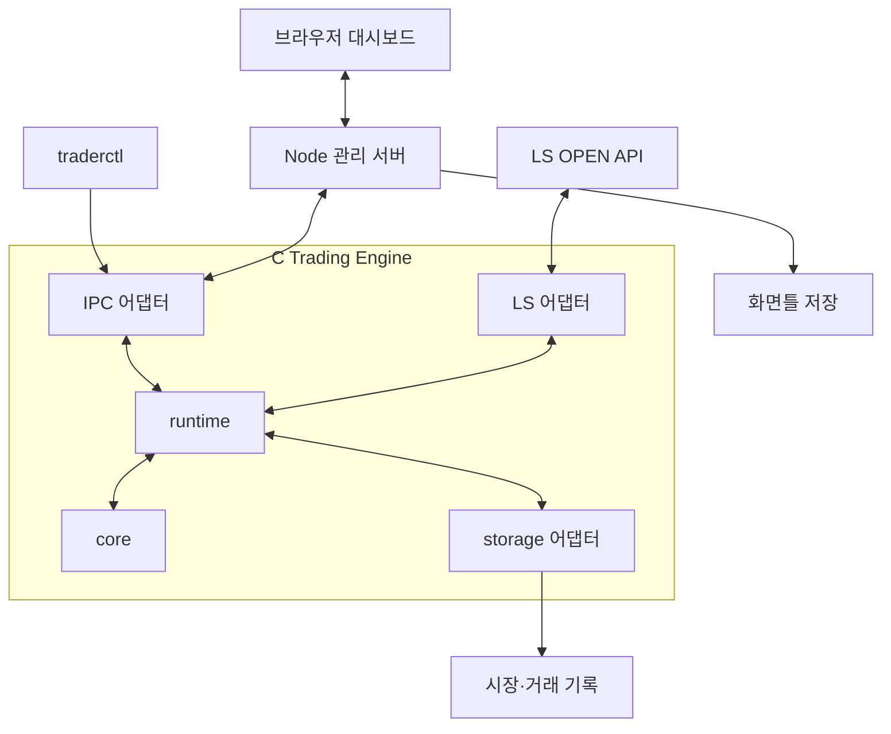

# C 기반 자동매매 시스템 — Kimi 전달용 통합 구현 계획서

버전: 1.0  
작성일: 2026-09-28 (Asia/Seoul)  
문서 상태: 전체 구현을 위한 기준 계획 / 실제 C 시스템 구현 미착수

## 0. 이 문서를 받는 구현 에이전트에게

이 문서는 개인용 C 자동매매 시스템 전체를 구현하기 위한 작업 기준이다. 구현은 Kimi가 담당한다. 단계마다 GPT에 검토를 요청하거나 이 대화로 돌아오는 절차는 없다. 아래의 의존 순서와 검증 기준에 따라 구현을 이어가고, 진행 기록과 실제 검증 결과를 저장소에 남긴다. 이후 운영·수정·추가 검토 방식은 사용자가 결정한다.

모든 기능을 한 번에 작성하라는 뜻은 아니다. 작은 변경 단위로 구현하고 직접 검증하며 전체 목표까지 진행한다. 명세 안의 구현 세부사항은 자율적으로 결정한다. 불명확한 증권사 동작이나 미제공 원본 수식은 추측으로 만들지 않는다. 영향을 받는 기능과 사유를 기록하고 독립적인 작업은 계속한다.

**실제 소스·실행 환경에 대한 현재 상태:** 제공된 자료는 YesLanguage 원본 6개와 설명용 HTML 2개다. C 엔진, Node 서버, 저장소, LS 접속, 테스트, CI는 아직 구현하거나 실행하지 않았다. 특정 Git 원격 저장소에 연결한 상태도 아니다. 이 문서의 API·명령·경로·스키마는 구현 명세 또는 기본 설계다.

### 상태를 해석하는 방법

| 구분 | 의미 | 구현 중 처리 |
|---|---|---|
| 확정 요구 | 사용자가 명시한 목적과 제약 | 우선 준수 |
| 기본 설계 | 전체 구현을 진행하기 위해 이 문서가 제시하는 권장 기본값 | 해당 작업에 적용하되 변경 이유와 영향 기록 |
| 확인 필요 | 실제 API·원본 실행·입력자료를 확인해야 하는 사항 | 검증 가능한 자료로 해결; 추측으로 확정하지 않음 |
| 추후 확장 | 초기 완성에 필요하지 않은 기능 | 기본 구현에 끼워 넣지 않음 |

## 1. 목표와 범위

C는 실시간 데이터, Tick, Candle/OHLCV, 보조지표, 전략 판단, 포지션, 리스크, 주문 상태와 주문 실행을 담당한다. Node.js/JavaScript는 웹 대시보드, 차트, 화면틀, 설정 요청, 로그·거래 조회와 리포트를 담당한다.

핵심 경로는 C 내부에서 완결한다. Node가 느리거나 종료되어도 엔진의 정상 입력·계산·매매 처리는 계속 가능해야 한다. 시세 장애나 주문 불명 상태에 대한 엔진 자체의 제한 정책은 별도로 적용한다.

초기 사용 경험은 다음과 같다.

1. C 엔진을 실행하고 CLI에서 상태를 확인한다.
2. 과거 또는 실시간 데이터를 공급받아 C가 미래곡선을 계산한다.
3. 대시보드에서 미래곡선과 필요한 지표를 표시한다.
4. 레이아웃과 지표 설정을 화면틀로 저장하고 다시 불러온다.
5. 같은 화면틀에서 종목을 바꿔 보되, 실행 중인 전략의 거래 대상은 유지한다.
6. 검증한 전략을 같은 C 코드로 백테스트·모의 실행·실거래에 연결한다.

| 확정 요구 | 설계에 미치는 영향 |
|---|---|
| C 중심, JavaScript는 관리·표현 | JavaScript가 핵심 지표나 매매 신호를 다시 계산하지 않음 |
| LS증권 REST API 사용 | LS 연결을 전용 어댑터로 구현 |
| 기존 YesLanguage 자산 포팅 | 원본 보존, 버전 추적, 실행 의미와 출력 비교 필요 |
| CLI 제어 선호 | 엔진과 별도 관리 클라이언트 제공 |
| 화면틀 저장·불러오기, 종목 전환 | 화면 설정과 종목 바인딩·실행 상태를 분리 |
| 실시간 IPC와 DB 분리 | DB 폴링을 실시간 C↔Node 통신으로 사용하지 않음 |
| 실거래와 백테스트의 전략 공유 | 입력 공급·시간·체결 모델을 교체 가능한 경계로 분리 |
| Windows/Linux | core의 OS·브로커·DB·UI 의존성 제거 |
| 과도한 HFT 구조 회피 | 단순한 상태 소유권, 제한된 큐, 측정 후 최적화 |

미래곡선의 이름은 미래가격의 정확성을 보장하지 않는다. 이 프로젝트의 포팅 완료 기준은 원본 동작과의 비교이며, 수익성 검증은 별도의 전략 평가다.

## 2. 구현 기본값과 선택지

| 영역 | 기본 설계 | 이유 / 대안 |
|---|---|---|
| 언어 | C17, C extensions 비활성 | 이식성을 우선. 필요 기능이 생기면 개별 검토 |
| 빌드 | CMake 3.24 이상 | OS별 네이티브 빌드 절차 통일 |
| 우선 컴파일러 | Linux GCC, Windows MSVC | Clang·MinGW는 후속 매트릭스로 추가 가능 |
| 실행 구조 | C 엔진·CLI 클라이언트·Node 서버 분리 | 각 프로세스 수명과 장애 영향 분리 |
| 상태 갱신 | core 상태를 하나의 실행 흐름에서 갱신 | 다중 상태 갱신 스레드는 측정된 병목 이후 검토 |
| REST | libcurl 우선 | LS 전용 HTTP 코드를 직접 구현하지 않음 |
| WebSocket | libwebsockets 우선 후보 | TLS·Windows/Linux·재접속·빌드 호환성을 확인 후 선택 |
| JSON | yyjson 우선 후보 | cJSON도 가능. 실제 API·메모리 소유권·빌드 편의 비교 |
| IPC | libzmq, 명령과 상태 스트림 분리 | ROUTER/DEALER + PUB/SUB 기본안; 단순 TCP 대안 |
| DB | SQLite, 거래 DB 쓰기 소유자는 C | PostgreSQL은 다중 사용자·원격 서비스 확장 시 검토 |
| Node | 구현 시점의 지원되는 LTS, ES Modules | 정확한 버전은 package.json과 잠금파일에 고정 |
| UI | 로컬 웹 대시보드 | Electron 패키징은 추후 확장 |
| 차트 | 요구 기능에 맞는 기존 라이브러리 선정 | 다중 선·미래 시점·이력·패널·데이터 갱신 지원 확인 |
| 의존성 관리 | C 의존성은 vcpkg manifest 우선 검토 | 채택하면 기준 버전 고정. 다른 방식 선택 시 Windows/Linux 재현 절차 제공 |
| TLS | 네트워크 라이브러리의 검증된 TLS 구성 사용 | 애플리케이션의 직접 OpenSSL 사용은 필요할 때만 추가 |

위 도구의 도입과 정확한 버전은 실제 설치·빌드로 확인한다. 존재하지 않는 API나 과거 버전 예제를 가정하지 않는다. 현재 시점의 공식 문서와 라이선스 조건을 확인하고 사용한 버전·출처를 기록한다. 필요한 기능에 비해 라이브러리 연동 비용이 크면 대안을 선택하고 이유를 남긴다.

## 3. 프로세스 구성



이 그림은 실행 중 연결 관계다. 각 상자를 프로세스나 스레드 하나로 구현할 필요는 없다. C 프로세스는 독립 실행하고, CLI·Node는 관리 명령과 상태 조회를 제공한다. CLI 종료나 브라우저 종료가 엔진 종료로 이어지지 않는다.

초기 관리 인터페이스는 loopback으로 제한한다. 원격 접속 기능을 추가할 때 인증·암호화·접근 범위를 별도 구성한다. 브라우저는 Node의 HTTP/WebSocket 인터페이스를 사용하며 ZeroMQ에 직접 연결하지 않는다.

## 4. C 모듈 구조와 의존성

| 위치 | 역할 | 담당하지 않는 것 |
|---|---|---|
| `src/app/` | main, 설정 로딩 순서, 실행 모드별 조립 | 지표 수식·매매 판단 |
| `src/runtime/` | 이벤트 순서, 시계, 명령 적용, 구독, 워밍업, 수명·복구 | 브로커별 파싱·지표 수식 |
| `src/core/model/` | 식별자, 단위, 시간, 유효성, 공통 값 | 외부 SDK 형식 |
| `src/core/market/` | Tick·호가·봉·최근 데이터·집계 | 차트 픽셀 렌더링 |
| `src/core/indicators/` | 지표 계산·내부 상태·출력 이력 | 주문 전송 |
| `src/core/strategy/` | 전략 인스턴스와 거래 의도 | REST·DB 직접 호출 |
| `src/core/portfolio/` | 포지션·현금·평가·PnL | 체결되지 않은 주문을 보유수량으로 반영 |
| `src/core/risk/` | 제한 검사·위험 예약 | UI 명령을 무조건 신뢰 |
| `src/core/order/` | 주문 상태·체결 중복 처리·실행 요청 | 네트워크 구현 |
| `src/adapters/ls/` | 인증, REST·WS, LS 형식 변환 | 전략 판단 |
| `src/adapters/history/` | 저장 데이터·파일 재생 | 미래 데이터를 현재 값으로 노출 |
| `src/adapters/simulator/` | 모의 접수·체결·수수료·지연 | 실제 LS 주문 호출 |
| `src/adapters/ipc/` | 메시지 직렬화·전달 | core 상태 직접 수정 |
| `src/adapters/storage/` | SQLite·마이그레이션·조회·저장 | 전략 규칙 |
| `src/adapters/logging/` | 로그 출력·회전·마스킹 | 로그 실패로 정상 화면 갱신 전체를 중단 |
| `src/platform/` | 시계·스레드·대기·파일·종료의 OS 차이 | 불필요한 범용 프레임워크 |
| `src/cli/` | 별도 CLI 실행 파일 | 엔진 상태의 복제본을 정답으로 취급 |
| `web/` | Node 서버·대시보드·화면틀 | 핵심 지표·전략 재구현 |
| `tests/` | 단위·통합·재생·장애 시나리오 | 실제 계좌 주문을 자동 실행하는 기본 테스트 |
| `reference/` | 변경하지 않는 원본과 자료 목록 | 원본에 버그 수정이나 포팅 결과 덮어쓰기 |

core는 C 표준 라이브러리와 수학 함수에 의존한다. runtime은 core와 외부 기능을 위한 인터페이스에 의존한다. adapters는 내부 데이터·인터페이스와 외부 라이브러리를 연결한다. app에서 필요한 구현을 선택해 주입한다.

인터페이스는 내부에서 필요로 하는 작은 함수 집합이다. 일반적인 C 함수 포인터와 명시적인 컨텍스트 전달로 시작한다. 동적 플러그인·안정 ABI·범용 메시지 버스 프레임워크는 초기 요구가 아니다. 외부 라이브러리 헤더가 core의 공개 헤더로 전파되지 않게 한다.

## 5. 상태 소유권과 실행 흐름

core의 변경은 runtime이 정한 하나의 흐름에서 처리한다. 네트워크·저장 작업이 다른 스레드에서 수행되더라도 그 콜백은 결과 이벤트를 전달하고 core를 직접 바꾸지 않는다. 모듈 수와 스레드 수를 일치시키지 않는다.

| 상태 | 소유자 | 갱신 원인 |
|---|---|---|
| 시세·봉 | market | 정규화한 시장 입력과 정정 정책 |
| 지표 상태·출력 이력 | indicators | 봉/호가 갱신·설정 버전 |
| 전략 실행 상태 | strategy | 입력 이벤트·엔진이 적용한 명령 |
| 실제 보유수량·실현손익 | portfolio | 확인된 체결·계좌 대사 |
| 평가가격·미실현손익 | portfolio | 시장가격 갱신 |
| 예약 위험·한도 | risk/order의 명시 계약 | 주문 의도·거절·체결·취소·대사 |
| 주문 상태 | order | 내부 요청·정규화한 브로커 이벤트 |
| 구독·순서·진행 상태 | runtime | 명령·타이머·입력·복구 |
| 화면틀·표시 스타일 | Node 관리 계층 | 사용자 UI 설정 |

시장 입력 처리의 기본 순서는 정규화 → 품질·중복 확인 → market → indicator → 활성 strategy → risk → order다. 체결 입력은 order와 portfolio를 갱신하고 예약량을 조정한다. 모든 시장 이벤트가 주문을 만드는 것은 아니다. 수동 주문도 같은 risk/order 경로를 따른다.

REST 대기나 대량 파일 읽기를 core 루프에서 수행하지 않는다. 입력·명령·저장·표시 큐에는 상한을 두고 용량과 포화 횟수를 노출한다. 표시용 최신값은 합칠 수 있다. 계산에 필요한 시장 입력·체결·명령 손실은 감지하고 상태를 제한·복구한다. 조용히 버린 뒤 정상으로 표시하지 않는다.

화면의 대량 조회·구독에도 한도와 처리 예산을 둔다. UI가 요청한 과거 데이터 재계산은 배치로 나누거나 작업 스레드에서 준비한다. 기존 전략 입력 처리의 지연을 측정하고 화면 요청 때문에 무한히 밀리지 않게 한다.

## 6. 공통 데이터 계약

실제 C 구조체를 정의할 때 필드의 단위, 범위, 소유권, 수명, 유효성, 누락 표현을 함께 문서화한다. 구조체 메모리를 그대로 IPC·파일에 쓰지 않는다.

| 모델 | 필수 의미 |
|---|---|
| Instrument | 내부 ID, 브로커 코드, 시장·상품 종류, 거래 가능 여부, 가격·수량 단위, 승수, 통화, 세션 참조 |
| Time | UTC 기준 이벤트 시각·수신 시각, 거래소 현지 시간의 해석, 영업일·세션 ID |
| EventEnvelope | 종류, 스키마 버전, 엔진 실행 ID, 처리 순번, 원본 ID/순번, 이벤트·수신 시각, 데이터 품질 |
| Tick | 종목, 체결 가격·수량, 원본 체결 식별 정보, 거래량 필드 의미 |
| OrderBook | 종목, 호가 시각, 가격·잔량, 합계 범위, 스냅숏/증분 여부, 유효성 |
| Candle | 종목·주기, 시작/종료 시각, OHLCV, 진행/확정 상태, revision, 입력 출처·품질 |
| IndicatorValue | 지표·구현 버전, 입력 묶음, 파라미터 버전, 기준 봉, 값, 유효성, 계산 순번 |
| TradeIntent | 전략/수동 출처, 계좌·종목, 방향·수량·주문 조건, 근거 이벤트와 설정 버전 |

시간 기본 저장은 UTC epoch 마이크로초의 int64로 제안한다. 원본 시간의 정밀도가 낮으면 그 사실을 보존한다. 타임아웃·경과 시간은 단조 시계로 측정한다. 전략은 주입받은 논리적 시간을 사용하며 시스템 현재 시간을 직접 조회하지 않는다.

주문 가격·수량·현금은 정의된 스케일의 정수 표현을 우선 사용하고 스케일과 승수를 명시한다. 지표 계산은 double을 사용하되 주문 값으로 변환할 때 유효성·범위·호가 단위와 반올림 규칙을 검사한다. 값의 부재와 숫자 0을 구분한다. overflow, 비정상 부동소수 값, 잘못된 단위는 오류로 처리한다.

원본 이벤트 시각과 엔진 처리 순서를 따로 기록한다. 단일 증권사 스트림을 넘는 전역 시간 순서가 보장된다고 가정하지 않는다. 다중 종목 결합 계산에는 각 입력의 시각·신선도와 정렬 정책을 적용한다.

## 7. Tick·호가·Candle

LS 어댑터가 누적 거래량인지 개별 체결량인지 구분해 내부 형식으로 변환한다. 중복 체결과 재접속 후 중복 데이터를 두 번 봉에 반영하지 않는다. 원본에 안정적인 ID가 없으면 대체 식별의 한계를 기록하고 재조회·대사 정책으로 보완한다.

봉은 내부적으로 `OPEN`과 `CLOSED` 상태를 가진다. 같은 봉의 새 입력은 OPEN 봉의 고가·저가·종가·거래량을 갱신한다. 봉 경계를 넘으면 이전 봉을 한 번 확정하고 새 봉을 연다. 장 종료 또는 다음 체결이 없는 경우의 확정 이벤트도 세션 일정과 기록 가능한 논리적 타이머로 처리한다.

원본 YesLanguage와 같은 시점의 결과를 비교해야 하는 계산에서는 봉 확정 시점과 반복 평가 의미를 호환 모드로 맞춘다. ‘다음 틱이 들어올 때 확정’과 ‘타이머로 확정’이 전략에서 같은 의미라고 가정하지 않는다. 정책과 버전을 기록해 재생에도 동일하게 적용한다.

Ring Buffer는 최근 고정 개수의 값을 유지한다. 기본 계약은 최신 확정 봉, 현재 OPEN 봉, 과거 확정 봉의 인덱스 의미를 명확히 구분하는 것이다. 최소 용량·유효 개수·덮어쓰기·범위 초과 조회를 검사한다. 한 봉의 반복 갱신으로 과거 봉이 계속 밀리지 않아야 한다.

거래 없는 봉을 만들지, 전 종가와 0 거래량으로 채울지는 종목·원본 호환 정책으로 지정한다. 수신 누락은 무거래와 다르다. 늦은 입력·과거 봉 정정은 revision과 영향 범위를 기록하고 관련 지표를 다시 계산할 수 있게 한다. 재계산한 과거 신호를 새 실시간 주문으로 실행하지 않는다.

## 8. 다중 주기와 세션

1분봉을 기본으로 5분·15분·60분 등을 집계하는 방식을 우선 사용한다. 정렬 기준은 거래 세션의 시작점이며 단순 UTC 시각 나머지만으로 구현하지 않는다. 일봉은 해당 상품의 영업일·세션 정의를 따른다. 야간장·휴장·조기 종료와 날짜 변경을 표현할 수 있어야 한다.

확정된 하위 봉으로 상위 확정 봉을 만든다. 진행 중인 상위 봉을 제공할 때는 미확정 상태를 표시하고, 전략이 이를 사용할지는 전략별 설정으로 정한다. 현재 시점에 확정되지 않은 당일 일봉 종가를 과거 1분봉 전략에 노출하지 않는다.

브로커가 제공하는 일봉과 자체 집계 일봉은 세션·수정주가·거래량 등의 의미가 다를 수 있다. 출처를 보존하고 혼용 전에 비교한다. 미래곡선의 일봉 연결에는 원본이 실제로 참조한 시점의 일봉 데이터를 제공한다.

YesLanguage 공식 설명에서 DayIndex는 자정 기준으로 차트에 존재하는 당일 봉 수를 뜻한다. 이를 영업일·장 시작과 무조건 동일시하지 않는다. 원본의 DayIndex 조건과 BDate 조건은 각각의 의미를 보존한다. [공식 DayIndex 설명](https://help.yesstock.com/21dd121b-e719-81d4-a85f-c790f521165f)

## 9. 지표 API와 상태

지표는 설정·내부 상태·출력·출력 이력을 가진 독립 인스턴스다. 인스턴스 키에는 구현명/버전, 종목 또는 입력 종목 묶음, 주기, 파라미터 버전, 세션 정책, 실행 모드가 포함된다. 같은 구현 코드가 여러 종목을 처리해도 상태는 섞이지 않는다.

| API 책임 | 계약 |
|---|---|
| create/init | 설정 검증, 필요한 입력·워밍업 길이·기능 요구 반환 |
| on_event | 봉 시작·현재 봉 갱신·봉 확정·호가 등의 이벤트 종류를 구분하여 처리 |
| read_output | 값, 유효성, 기준 시각, 입력 revision, stale 여부를 반환 |
| reset | 세션 전환·설정 변경 등 명시된 이유로 초기화 |
| checkpoint/restore | 필요한 경우 버전 있는 상태 저장·복구; 미지원이면 입력 재생으로 복구 |
| destroy | 소유한 메모리 해제 |

함수 이름과 세부 시그니처는 구현 중 정해도 되지만 위 계약과 소유권은 유지한다. 시장 데이터는 읽기 전용 뷰로 전달한다. 출력은 수치·구분·유효성·예측 기준 시점 등으로 구성하고 색상·선 굵기·패널 위치는 UI 설정으로 매핑한다.

EMA 등 증분 계산이 적절한 지표는 증분 구현한다. 작은 회귀 구간처럼 전체 계산이 단순하고 충분히 빠른 경우에는 정확성을 먼저 확보한다. 최적화 전후에 같은 입력·유효성·수치 허용오차를 비교한다. 최초 상태와 표준편차 분모·ATR/RSI 초기값 등 계산 관례를 명시한다.

진행 봉 계산과 확정 이력을 구분한다. 원본의 `[1]`은 원칙적으로 이전 봉 참조이며 이전 함수 호출을 의미하지 않는다. 현재 봉 재평가가 내부 누적을 중복 반영하지 않도록 확정 상태와 진행 상태를 관리한다. 정확한 원본 실행 의미가 다른 경우에는 호환 구현을 별도 명세한다.

## 10. 미래곡선 포팅 명세

### 10.1 현재 제공된 자료

원본 6개와 HTML 2개를 원래 바이트 그대로 동봉한다. 파일 경로·원래 이름·SHA-256은 [원본 자료 목록](reference/SOURCE_INDEX.md)에 기록한다. 파일명이 바뀐 자료는 목록에서 대응 관계를 확인한다.

| 자료 | 용도와 주의점 |
|---|---|
| `#우드스탁_미래곡선_1분봉.txt` | 헤더에 V16_1분봉용 표시. 계산과 Plot/TL 표시를 포함한 기준 후보 |
| `WSF_MiraeCurve1mFullOutputV1.txt` | 69개 OUT NumericRef 출력. 계산 결과 분리의 참고이나 원본 화면과 완전히 같은 버전으로 간주하지 않음 |
| `WSF_Mtf_LinRegV3.txt` | 회귀·유효성·R²·잔차, 제공 버전에서는 V4 호출도 포함 |
| `WSF_Mtf_LinRegPredictV4.txt` | 회귀 기울기·R²·ATR·가속도 제한 기반 예측 |
| `WSF_Htf_CurvePredict.txt` | 별도 19개 표본 회귀와 원시 예측. 현재 제공되어 있음 |
| `WSF_OrderBookDirectionV2.txt` | 호가 잔량 기반 점수·기울기·상태 |
| `미래곡선그리기.html` | 화면 이해용 근사 재현 |
| `미래곡선그리기_코드엑스레이.html` | 계산과 표시의 대응을 설명하는 근사 재현 |

HTML에는 HTS 실제 출력이 아니며 호가 자료가 없다는 설명이 있다. 이를 숫자 비교의 정답 데이터로 사용하지 않는다. HTML 내부의 일부 상대 링크는 동봉되지 않은 다른 설명서를 가리킨다. 원본 보존을 위해 내용을 수정하지 않는다.

제공 자료는 보조지표 계산·표시 코드다. 검토한 파일에서 Buy/Sell 등의 주문 호출은 확인되지 않았다. 표시 점수만으로 진입·청산 전략이 완성되었다고 간주하지 않는다.

### 10.2 이미 확인된 차이와 누락

| ID | 사항 | 처리 원칙 |
|---|---|---|
| P01 | 주요 호출부의 LinRegV3는 7개 인자, 제공 정의는 19개 인자 | 실행 중인 기준 버전을 식별. 임의로 인자를 덧붙여 기준 버전이라고 선언하지 않음 |
| P02 | 제공 V3 내부에서 V4를 호출하지만 호출부에도 V4 호출 존재 | 호출 단위 상태와 중복 실행 영향을 확인하고 호환 구성을 명시 |
| P03 | Htf의 `DayIndex()%1 == 0`은 정수 DayIndex에 대해 항상 참 | 새 봉을 한 번만 감지하는 조건으로 해석하지 않음. 원본 반복 평가·롤백 의미 확인 |
| P04 | 원본 시계열 `[1]`, `[3]`와 상태 누적 | 이전 봉과 이전 틱/호출을 구분 |
| P05 | 호가 V1·V2가 모두 호출되나 V1 정의는 미제공 | V2를 V1 대신 조용히 대입하지 않음 |
| P06 | 실제 HTS 기준 출력과 동일 입력 묶음 미제공 | 수식 단위 검증은 수행하되 전체 원본 일치 완료는 별도 상태로 기록 |

현재 자료 묶음에서 정의가 없는 함수는 다음과 같다.

| 함수 | 영향 |
|---|---|
| `WSF_1m_DailyTrendLinkV1` | 1분봉과 일봉 추세 연결 |
| `WSF_GapRegimeV1` | 갭 상태·일봉 가중 관련 계산 |
| `WSF_1m_DailyAlignV2` | 일봉 정렬·최종 운영 상태 관련 계산 |
| `WSF_OrderBookDirectionV1` | 일부 호가 결합 경로 |
| `WSF_AutoSessionADXV1` | 메인 원본의 ADX 관련 경로. 최종 표시·출력까지의 영향 확인 필요 |
| `WSF_DailyMarketProfileV1` | 비1분봉 분기. 초기 1분봉 전용 범위에서는 분리 가능 |

원본이 추가되면 입력·출력 계약과 호출 그래프부터 연결한다. 미제공 함수를 이름만 보고 재작성하지 않는다. 의존하는 출력은 `UNSUPPORTED` 또는 `MISSING_DEPENDENCY`로 표시하고, 독립적인 계산부는 구현·검증한다. 전체 지표와 부분 구현의 버전을 구분한다.

### 10.3 반드시 보존할 계산 의미

- V3는 새 봉에서 배열을 이동하고 같은 봉에서는 최신 가격을 갱신한다. 제공 코드의 1분봉 회귀 길이는 30, 최소 회귀 표본은 5다. 모든 출력의 워밍업을 임의로 30봉으로 통일하지 않는다.
- R²는 회귀 적합도다. 이를 예측 성공 확률로 이름 붙이거나 UI에 확률로 표시하지 않는다.
- V4는 R² 기반 계수와 ATR 기반 기울기·가속도·변위 제한을 사용한다. 가속도는 기울기의 3봉 전 값을 참조하며 같은 방향 가속을 억제한다. 초기 ATR과 이전 봉 참조 의미까지 비교한다.
- Htf는 V3/V4와 별도 회귀 상태다. 공통 회귀 유틸리티를 재사용할 수 있지만 두 지표 인스턴스의 이력을 합치지 않는다.
- Htf의 ‘방향’ 출력은 예측가격과 `MinLRL[k+1]`의 차이인 수치다. 이를 처음부터 -1/0/+1 열거값으로 바꾸면 후속 비교 결과가 달라진다.
- 메인의 일부 점수는 방향이 0일 때도 음수 분기로 들어간다. 이상해 보여도 원본 호환 구현에서는 임의로 중립으로 바꾸지 않는다. 개선은 별도 버전과 변경 근거로 남긴다.
- 호가 V2는 Bids/Asks, CodeCategory, BDate와 시계열 상태를 사용한다. 호가 합계의 범위와 원본 잔량 의미를 LS 필드에 맞춰 확인한다.
- 진행 중인 예측값과 전환 시점에 고정한 기억선·목표선을 구분한다. 고정값은 기준 시점·세션·목표 시점과 함께 유지한다.
- 예상 미래 위치를 차트에 그리는 것과 실제 미래 데이터를 참조하는 것은 구분한다. 예측 결과에는 생성 시점이 있어야 한다.

원본의 수상한 코드, 초기 0 채움, 반올림, 사용되지 않는 변수 등을 정리할 때도 먼저 호환 결과에 영향을 주는지 확인한다. 호환 버전과 개선 버전을 같은 이름으로 바꾸지 않는다.

### 10.4 비교 자료와 완료 수준

원본 비교 자료는 종목, 기간, 세션, 차트 주기, 파라미터, 함수 버전, 필요한 과거 입력, 봉별 출력과 유효성을 포함해야 한다. 호가 의존 출력은 같은 호가 입력 또는 동등한 기록이 필요하다. 틱 단위 동작을 비교하려면 최종 OHLCV만으로 충분하지 않다.

수치 비교는 필드별 절대·상대 허용오차를 정한다. 방향·유효성·상태·기준 봉·고정 시점은 별도로 비교한다. 보고서에는 최초 불일치 이벤트, 해당 입력과 이전 상태, 원본/C 출력, 최대 오차를 기록한다. 허용오차를 넓혀 상태 불일치를 숨기지 않는다.

완료 수준은 `부분 구현`, `수식 검증`, `봉 확정 출력 비교`, `장중 갱신 비교`, `전체 의존성 포함 비교`처럼 분리한다. 확보한 증거 이상의 완료 상태를 보고하지 않는다.

## 11. 전략 API와 공통 실행

전략은 인스턴스별 설정·상태를 가진다. 초기화, 입력 요구사항 선언, 이벤트 처리, 상태 조회, 중지/재개, 복구 책임을 제공한다. 이벤트 처리의 출력은 TradeIntent 또는 목표 포지션 의도다. SDK 주문 함수나 DB를 직접 호출하지 않는다.

runtime은 전략에 필요한 시장·지표·포지션의 읽기 전용 뷰와 논리적 시각을 전달한다. 전략은 입력의 유효성·신선도를 확인하고 판단한다. 같은 이벤트와 같은 이전 상태에서 같은 의도가 나와야 한다. 난수가 필요한 전략은 seed와 상태를 기록한다.

전략의 실행 주기는 봉 확정·진행 봉·틱 중 명시적으로 선택한다. 여러 지표/종목을 사용하는 경우 입력 준비 조건과 최신 시점 기준을 선언한다. 예를 들어 한 종목만 갱신된 상태에서 오래된 다른 종목을 현재 값으로 혼합하지 않는다.

미래곡선 지표를 실제 매매 전략으로 연결하려면 진입, 청산, 수량, 중복 신호, 반대 신호, 최대 보유, 세션 종료와 재시작 정책이 별도로 필요하다. 이 규칙이 없으면 지표 조회 기능으로 제공한다. 테스트용 예제 전략은 제품 전략과 별도 이름으로 둔다.

## 12. 포지션과 포트폴리오

계좌·상품별 실제 순포지션을 기준으로 하고 전략별 기여분을 별도로 추적한다. 여러 전략이 같은 계좌·종목을 거래할 때는 초기 기본 정책을 ‘독점 소유’로 두고, 공유가 필요하면 명시적인 배분·상계 정책을 구현한다. 외부 수동 거래는 출처 불명 거래로 기록하고 실제 계좌 상태와 대사한다.

Position은 종목, 실제 수량, 평균 단가, 실현손익, 평가가격·시각, 미실현손익, 수수료·세금, 승수·통화를 가진다. 상품에 따라 평균가·청산 계산이 달라질 수 있으므로 상품별 계산 규칙을 검증한다.

현금과 주문 예약금, 보유수량과 미체결 예약수량을 분리한다. 부분 체결은 체결된 수량만 포지션에 반영하고 나머지 위험 예약을 유지한다. 대사로 실제 수량을 보정할 때는 차이와 이유를 기록한다. 단순 시장가격 갱신으로 실제 보유수량을 바꾸지 않는다.

계좌 전체 실제 상태와 전략 내부 추정 상태가 다르면 신규 위험을 제한하는 정책을 적용한다. UI에 보이는 값에는 계좌 기준/전략 기준과 평가 시각을 명시한다.

## 13. 리스크 엔진

리스크 검사는 자동 전략과 수동 주문에 공통으로 적용한다. 승인 여부, 거절 이유, 예약할 위험 노출을 반환한다. 주문 실행 전 모든 경로가 이 단계를 거치게 한다.

| 검사 | 필요한 입력 |
|---|---|
| 종목·계좌·주문 종류 허용 | 상품 메타데이터·계좌 설정 |
| 가격·수량·호가 단위 | 정규화한 주문 값·시세 |
| 주문별 최대 수량·금액 | 명시한 제한값 |
| 종목·계좌 총 노출 | 실제 포지션 + 미체결 위험 예약 |
| 주문 빈도·미체결 수 | 계좌별 주문 상태와 최근 요청 이력 |
| 손실·운영 제한 | 정의된 일일 PnL 기준·제한 정책 |
| 시세 신선도·유효성 | 이벤트 시각·누락·연결 상태 |
| 운영 상태 | 워밍업·대사·저장 실패·불명 주문·신규 진입 제한 |

실거래 한도 수치는 사용자의 운영 설정으로 받아야 한다. 임의의 금액을 적정 한도로 정하지 않는다. 필수 한도가 비어 있으면 실거래 시작 조건을 충족하지 못한 것으로 처리한다. 모의 검증용 설정은 실제 계좌 설정과 명확히 구분한다.

신규 위험 확대와 위험 축소 주문의 허용 정책을 구분할 수 있어야 한다. 시세가 불명확하다는 이유로 자동 시장가 청산을 추측해 실행하지 않는다. 다리 여러 개의 거래는 원자적 체결을 가정하지 않고 한쪽만 체결된 경우의 노출과 대응을 별도 설계한다.

## 14. 주문 상태와 실행

주문 의도, 내부 주문, 브로커 주문, 체결을 별도 개념으로 둔다. 내부 주문 ID는 제출 전 생성하고 브로커 주문 ID와 연결한다. 전송 성공, API 요청 성공, 주문 접수, 실제 체결을 서로 구분한다.

| 주문 생명 상태 | 의미 |
|---|---|
| CREATED | 의도에서 내부 주문 생성 |
| PENDING_SUBMIT | 리스크·내구성 조건을 충족하기 위해 준비 중이거나 제출 대기 |
| SUBMIT_UNKNOWN | 전송 후 결과를 확정할 수 없음 |
| WORKING | 브로커에서 유효한 미체결 주문으로 확인 |
| PARTIALLY_FILLED | 일부 수량 체결, 잔량 존재 |
| FILLED | 전체 체결 확인 |
| CANCELED | 취소가 확인된 잔량. 이미 체결된 수량은 유지 |
| REJECTED | 원 주문의 거절 확인 |
| EXPIRED | 유효기간 종료 등으로 종료 확인 |

취소·정정 요청의 진행 상태는 위 생명 상태와 별도로 관리한다. 취소 요청을 보냈다는 사실만으로 CANCELED로 바꾸지 않는다. 취소가 거절돼도 원 주문을 REJECTED로 바꾸지 않는다. 취소 대기 중 체결이 도착할 수 있다.

기본 전송 순서는 리스크 예약 → 내부 주문·제출 의도 영구 기록 → 기록 완료 확인 → 브로커 제출이다. 저장은 작업 스레드에서 할 수 있지만 기록 완료 이벤트 전에는 제출하지 않는다. 제출 결과·체결·취소 결과도 내구성 있는 이력으로 보존한다.

타임아웃이나 연결 단절은 거절이 아니다. 브로커 접수 가능성이 남으면 UNKNOWN으로 두고 조회·대사한다. LS API가 실제로 지원하는 중복 방지 필드·조회 방법을 확인하기 전에는 동일 주문 재전송이 안전하다고 가정하지 않는다.

체결 ID와 브로커 누적 체결량을 이용해 중복·역순 이벤트를 처리한다. 뒤늦은 접수 이벤트로 FILLED를 WORKING으로 되돌리지 않는다. 종료 상태라도 아직 반영하지 않은 실제 체결은 무시하지 않는다. 정정으로 브로커 주문 번호가 바뀌는 경우 원 주문과 연결 관계를 보존한다.

상태 전이 표에는 허용 전이, 입력 근거, 변경할 누적 수량, 예약 해제량, 중복 시 동작을 적는다. 최종 전이는 해당 LS 상품의 실제 이벤트 의미로 검증한다.

## 15. LS 브로커 어댑터

LS 공식 OPEN API는 REST와 WebSocket 인터페이스를 안내한다. 이 문서는 특정 TR 번호, 호출 한도, 필드명, 토큰 수명이나 상품별 지원을 확정하지 않는다. 구현 에이전트가 실제 사용할 API 명세를 확인하고 매핑 문서를 작성한다. [공식 안내](https://openapi.ls-sec.co.kr/intro)

| 기능 | 구현 책임 |
|---|---|
| 인증 | 키 로딩, 토큰 발급·만료 감지·갱신, 실패 상태 |
| 종목 정보 | 내부 Instrument와 LS 코드·상품 메타데이터 연결 |
| 과거 데이터 | 페이지/연속 조회, 중복·누락·정렬, 출처·수정 여부 |
| 실시간 | 체결·호가·주문/체결 통보의 개별 구독 관리 |
| 주문 | 신규·정정·취소 요청과 응답의 정규화 |
| 계좌 조회 | 잔고·포지션·미체결·체결 이력의 대사 입력 |
| 제한 관리 | API별 호출 한도, 우선순위, 대기·재시도 |
| 복구 | 재인증·재연결·재구독, 입력 공백 감지와 보충 |

API 키와 Secret은 엔진 실행 환경의 비밀 설정으로 로딩한다. 브라우저 번들·화면틀·Git·일반 로그에 포함하지 않는다. 인증정보가 없는 환경에서도 replay/backtest와 단위 검증이 동작해야 한다.

조회 실패는 API 의미에 맞춰 제한된 재시도를 할 수 있다. 주문 요청은 결과 불명 상태를 먼저 해소한다. 조회와 주문을 같은 무조건 재시도 함수로 처리하지 않는다. HTTP 상태, API 본문 오류, 전송 오류, 파싱 오류를 구분한다.

재연결 이후에는 구독 복원만으로 데이터 연속성이 회복됐다고 선언하지 않는다. 과거 보충·스냅숏과 실시간 스트림의 경계를 맞추고 대사한다. 지원하지 않는 과거 호가 복구 등은 기능 한계로 표시한다.

## 16. C ↔ Node/CLI 프로토콜

초기 전송은 로컬 TCP 위의 ZeroMQ로 제안한다. 명령/응답은 ROUTER/DEALER, 표시용 이벤트는 PUB/SUB를 사용한다. 소켓별 소유 스레드를 명확히 하고 같은 비스레드안전 소켓을 여러 스레드에서 공유하지 않는다.

PUB/SUB는 느린 구독자 때문에 일부 메시지가 버려질 수 있으므로 주문의 유일한 기록이나 신뢰성 있는 명령 경로로 사용하지 않는다. 명령의 처리 결과와 거래 이력은 별도 조회로 회복할 수 있어야 한다. [libzmq 소켓 공식 문서](https://libzmq.readthedocs.io/en/latest/zmq_socket.html)

IPC 송신은 core 루프에서 수신자 응답을 무기한 기다리지 않게 한다. 비차단 송신이나 별도 I/O 처리를 사용하고, 송신 큐 포화 시 표시용 데이터는 합치며 명령 결과는 보존 후 재조회하도록 한다. Node 단절이 엔진 상태 갱신을 막지 않아야 한다.

| 공통 필드 | 의미 |
|---|---|
| protocol_version, message_type | 호환 버전과 메시지 종류 |
| engine_instance_id | 엔진 재시작을 식별하는 실행 ID |
| request_id, command_id | 응답 연결과 명령 중복 처리 |
| stream_id, sequence | 해당 스트림의 순서. 구독 필터와 순번 범위를 명시 |
| event_time, emitted_at | 데이터 기준 시각과 발행 시각 |
| instrument_id, timeframe | 필요한 메시지의 시장 대상 |
| config_version, generation | 설정·화면 요청의 버전 |
| status, error_code, payload | 처리 상태·오류·내용 |

JSON을 초기 직렬화 형식으로 사용한다. int64 시간·가격·순번 등 JavaScript 안전 정수 범위를 넘을 수 있는 값은 문자열로 전송하고 형식을 명세한다. NaN/Infinity를 JSON 숫자로 보내지 않는다. 수치 유효성 필드를 사용한다. 메시지 크기·문자열 길이·배열 개수·알 수 없는 필드/버전 처리 정책을 정한다.

명령 결과는 ‘수신됨’, ‘엔진에 적용됨’, ‘거절됨’을 구분한다. 주문의 ‘브로커 접수’와 ‘체결’은 별도 주문 이벤트다. accepted 응답을 체결 성공으로 표시하지 않는다. 같은 command_id와 다른 내용이 오면 충돌로 거절한다.

효과가 있는 명령의 ID·내용 해시·최종 결과를 보존해 재연결·재시작 후 중복 요청을 확인한다. 보존 기간을 넘었거나 결과를 알 수 없으면 상태 조회가 필요하다고 응답한다. 전송 라이브러리만으로 exactly-once 주문 실행을 보장한다고 주장하지 않는다.

상태 스트림을 놓치거나 엔진 실행 ID가 바뀌면 스냅숏을 다시 받는다. 스냅숏 기준 순번과 이후 이벤트를 연결해 공백·역전을 막는다. 전역 순번을 필터된 구독에 그대로 적용해 정상적인 번호 공백을 손실로 오인하지 않는다.

화면용 갱신 주기는 초기 기본값 5Hz를 제안하며 설정 가능하게 한다. 원시 입력·전략 계산 주기와는 독립이다. heartbeat 역시 설정 가능한 연결 상태 표시 수단이며, Node heartbeat 손실을 자동매매 중단 조건으로 삼지 않는다.

## 17. CLI

별도 실행 파일 `traderctl`을 기본안으로 한다. 일반 명령 실행과 선택적인 대화형 shell을 제공할 수 있다. shell에서도 같은 명령 API를 사용한다. 엔진을 직접 시작하는 실행 파일은 `trading-engine`으로 구분한다.

아래는 구현할 명령 계열의 예시이며, 세부 옵션은 일관된 help와 함께 확정한다.

| 명령 계열 | 역할 |
|---|---|
| `traderctl status` | 엔진 모드·연결·복구·제한 상태 |
| `traderctl market ...` | 종목·데이터·구독 조회 |
| `traderctl indicator ...` | 지표 인스턴스·설정·유효성 조회 |
| `traderctl strategy list/start/stop ...` | 전략의 수명 제어 |
| `traderctl risk ...` | 제한 조회·명시적 변경 |
| `traderctl orders ...` | 주문 조회·수동 요청·취소 등 |
| `traderctl positions ...` | 계좌·포지션 조회 |
| `traderctl engine stop` | 엔진 정상 종료 요청 |
| `traderctl shell` | 선택적인 대화형 관리 프롬프트 |

사람이 읽는 출력과 `--json` 출력을 제공한다. 명령 실패는 nonzero 종료 코드와 원인 코드로 표현한다. 연결 불가, 엔진 거절, 처리 대기, 완료를 구분한다. 자동완성·컬러·명령 이력은 기본 기능 이후 추가한다.

전략 중지는 신규 전략 판단을 멈추는 기능으로 정의하고, 미체결 취소나 포지션 청산과 결합하지 않는다. 일괄 작업이 필요하면 수행할 동작을 명시한 별도 명령으로 구현한다. 화면 열기·화면틀 저장 명령을 CLI에 제공할 경우 Node 관리 API로 전달한다.

## 18. 대시보드와 화면틀

Node는 HTTP 조회·설정 API와 브라우저 WebSocket을 제공한다. C의 값을 받아 UI에 전달하고 필요한 형식 변환·표시용 정렬을 수행한다. 매매용 지표·전략은 C의 결과를 사용한다. 화면을 위한 축·색·선·패널 배치는 JavaScript에서 처리한다.

| 기본 화면 | 표시할 내용 |
|---|---|
| 엔진 상태 | live/paper/replay/backtest 구분, 연결, 지연, 워밍업·복구·제한 상태 |
| 차트 | Candle, 미래곡선과 지표, 진행/확정 구분, 고정 기억선·예측 기준 시점 |
| 종목 선택 | 검색, 즐겨찾기, 지원 데이터와 지표 기능 |
| 전략 | 실행 상태·대상·파라미터·최근 판단 |
| 계좌·주문 | 포지션·PnL, 주문 상태·부분 체결·불명 상태 |
| 로그·이력 | 필터·페이지 조회, 오류 원인과 연결되는 이벤트/주문 ID |
| 설정 | 적용 중인 버전, 변경 요청 결과, 재시작 필요 여부 |

차트 라이브러리는 OHLCV, 복수 패널, 여러 선·밴드, 미래 시간 위치, 과거 선 이력, 다중 종목 전환, 실시간 갱신과 화면 크기 변경을 검증한 뒤 선정한다. 필요한 사용자 정의 선을 지원하는지 작은 기능 검증으로 확인한다. 데이터가 없는 미래 시점을 렌더링한다고 미래 가격 데이터가 존재하는 것처럼 처리하지 않는다.

화면틀(Workspace)은 레이아웃, 패널, 지표 ID·버전·파라미터, 주기, 스타일, 종목 바인딩, 현재 선택 종목, 스키마 버전을 저장한다. 저장·불러오기·다른 이름 저장·삭제·기본 화면틀 지정·마지막 화면 복원을 제공한다. 저장 중 실패하면 기존 파일을 보존하고 원자적인 파일 교체를 사용한다.

패널의 종목 바인딩은 다음 두 종류를 지원한다.

- `selected`: 화면의 선택 종목을 따라간다.
- `fixed`: 지정한 지수·종목을 계속 표시한다.

여러 패널을 함께 바꾸는 연결 그룹도 표현할 수 있게 한다. 선택 종목 변경은 화면 상태 변경이며 전략 거래 대상 변경 API를 호출하지 않는다. 종목이 바뀌면 해당 종목·주기·설정에 맞는 C 지표 상태를 요청하고 워밍업 상태를 표시한다.

종목 변경마다 generation을 올려 이전 요청의 늦은 응답을 폐기한다. 새 종목 제목 아래 옛 종목의 지표가 표시되는 혼합을 방지한다. 스냅숏과 스트림은 같은 종목·세대·설정 버전으로 연결한다. 화면 전환 후 오래된 구독을 해제하되 전략이 여전히 사용하는 데이터 구독은 유지한다.

지수에 호가 등 필요한 입력이 없으면 해당 구성요소가 지원되지 않음을 표시한다. 호가를 임의의 0이나 다른 선물 종목 데이터로 채워 전체 지표가 정상이라고 표시하지 않는다. 부분 지표는 명시적인 기능 프로필로 제공하고 완전한 지표와 이름·유효성·매매 사용 가능 여부를 구분한다.

화면틀에는 API 키·계좌 비밀·실제 엔진의 변경 가능한 포지션 상태를 넣지 않는다. 화면 복원으로 전략을 자동 시작하거나 실제 주문을 재실행하지 않는다. 로컬 웹서버도 변경 요청에 대해 인증 토큰·Origin 등 기본 접근 검사를 적용한다.

## 19. 다중 종목·구독·자원 관리

runtime의 구독 관리자는 화면과 전략의 데이터 요구를 모은다. 동일한 시장 입력은 공유하되 소비자별 수명을 추적한다. 마지막 화면이 닫혀도 전략이 참조하는 구독은 유지한다. 최종 소비자가 없어지면 지표 캐시와 수신 구독을 정해진 정책에 따라 정리한다.

처음에는 설정 가능한 종목·지표·화면·과거 봉 개수 상한을 둔다. 실제 기본값은 대상 상품의 입력량과 성능 측정으로 정한다. 메모리는 종목 수 × 봉 용량 × 봉 크기와 지표 상태·출력 이력·큐 용량으로 계산해 보고한다.

관심 화면을 새로 여는 작업은 주문 경로와 다른 우선순위로 처리한다. 과도한 구독 요청은 명시적으로 거절하거나 대기시키고, 이미 실행 중인 전략의 입력을 뺏지 않는다. 단일 루프 처리량이 부족하다는 근거가 나온 뒤에만 종목별 분할이나 별도 계산 워커를 검토한다.

상관관계·Pair spread 같은 다중 종목 지표를 수용할 수 있도록 입력 묶음과 시간 정렬 계약을 둔다. 실제 Pair 전략의 주문·동시 체결 정책은 해당 전략을 구현할 때 정의한다.

## 20. 영구 저장과 초기 DB 스키마

거래·시장 기록은 C storage 어댑터가 쓰기를 소유한다. Node의 이력 조회는 관리 조회 API를 기본으로 하고, 필요 시 별도의 읽기 전용 DB 연결을 사용할 수 있다. 어느 쪽이든 DB를 실시간 엔진 명령 큐로 사용하지 않는다. 화면틀은 Node가 별도 JSON 파일 또는 관리 설정 저장소로 소유한다.

SQLite는 단일 쓰기 담당을 두고 WAL을 우선 검토한다. WAL 환경에서도 동시 작성자는 하나라는 제약이 있다. 중요한 주문 기록은 내구성 설정과 트랜잭션 완료를 확인한다. 초기에는 거래 기록 내구성을 우선해 synchronous=FULL을 기본안으로 둔다. [SQLite WAL 공식 설명](https://www.sqlite.org/wal.html)

초기 DB는 `engine.db` 하나로 시작할 수 있다. 과거 데이터 대량 적재가 주문 기록을 지연시키면 기록 우선순위·배치 크기를 조정하고, 실제 필요가 확인되면 시장 DB를 분리한다. 매 틱마다 모든 테이블을 갱신하지 않는다.

| 테이블 | 주요 필드 | 키·규칙 |
|---|---|---|
| schema_migrations | version, applied_at, checksum | version 고유 |
| instruments | instrument_id, broker_code, market, product_type, scales, multiplier, currency, session_policy, metadata_version | 내부 ID 기본키, 브로커 코드 범위 명시 |
| candles | instrument_id, timeframe, open_time, close_time, OHLC 단위값, volume, source_id, is_closed, revision, quality | 종목+주기+시작+출처를 고유키로, 최신 revision 유지 |
| strategy_runs | run_id, strategy_id/version, mode, config_version, input_manifest, start/end, status | run_id 기본키 |
| orders | order_id, run_id, account_id, instrument_id, side, type, quantity, prices, broker_id, state, cumulative_fill, timestamps | 내부 ID 고유, 브로커 ID 고유 범위는 API 확인 |
| order_events | event_id, order_id, engine_sequence, event_type, source_id, times, payload | 추가 기록, 중복 근거 보존 |
| fills | fill_id, order_id, account_id, instrument_id, quantity, price, fees, source_execution_id, executed_at | 실제 체결 고유성 범위에 맞춘 중복 제약 |
| position_snapshots | account_id, instrument_id, as_of_sequence, quantity, avg_price, realized_pnl, provenance | 복구용 스냅숏이며 원 체결 이력과 연결 |
| commands | command_id, payload_hash, command_type, state, result, created/applied_at | 같은 ID·다른 내용 거절 |
| config_versions | config_version, scope, contents, effective_sequence, created_at | 변경 이력 보존, 비밀값 제외 |
| backtest_runs | run_id, input_hash, code/config versions, clock/fill/cost policy, seed, metrics, artifact_paths | 결과를 재현할 자료 연결 |
| checkpoints | checkpoint_id, schema/code versions, as_of_sequence, state_path/hash | 채택한 상태 저장 방식에만 사용 |
| pnl_snapshots | run/account/strategy scope, time, realized/unrealized, fees, valuation_basis | 파생 통계, 원 거래 이력의 대체물 아님 |

계좌에 영향을 주는 체결·주문·포지션 스냅숏은 일관된 트랜잭션으로 기록한다. 미영속 계좌 상태를 근거로 새로운 주문을 계속 보내지 않도록 critical 기록 완료 경계를 둔다. 계산 가능한 위험 예약은 재시작 시 주문 상태에서 재구성하되 누락이 없는지 확인한다.

지표 출력은 화면 이력·원본 비교에 필요한 범위에서 별도 저장할 수 있다. 모든 틱의 모든 지표 출력을 무조건 DB에 적재하지 않는다. 틱·호가 재생이 필요하면 원본 순서와 정규화 버전을 가진 입력 기록을 별도 파일/테이블로 보존하고 보관 기간과 용량을 관리한다.

DB 마이그레이션은 버전과 실패 복구 절차를 가진다. 실행 중 DB 파일만 복사해 백업이 완전하다고 간주하지 않는다. SQLite 백업 API 등 일관성 있는 방법을 사용하고 복원도 검증한다. [SQLite Backup API](https://www.sqlite.org/backup.html)

## 21. Live·Replay·Backtest·Paper 실행

| 모드 | 시장 입력 | 시간 | 주문 실행 |
|---|---|---|---|
| replay | 저장된 시장 이벤트 | 기록된 논리 시간, 속도 조절 가능 | 기본적으로 실행하지 않음 |
| backtest | 고정한 과거 입력 | 시뮬레이션 시간 | 체결 모델 |
| paper | LS 실시간 입력 | 실시간 논리 시간 | 체결 모델 |
| live | LS 실시간 입력 | 실시간 논리 시간 | LS 주문 어댑터 |

app이 입력 소스·시계·실행 어댑터를 조립하고 core의 지표·전략·리스크·주문 계약은 공유한다. 같은 Strategy 코드를 사용한다는 이유만으로 결과 손익까지 같다고 주장하지 않는다. 실제 체결과 모의 체결은 다르다.

백테스트 실행에는 입력 해시, 기간, 종목·세션, 데이터 수정 기준, 코드·설정 버전, 비용 모델, 지연·슬리피지 모델, seed를 기록한다. 전략에 아직 도착하지 않은 미래 데이터를 노출하지 않는다. 전략이 확정 봉을 보고 만든 주문을 그 판단 이전의 유리한 가격으로 체결시키지 않는다.

최종 1분 OHLCV만 있는 경우 그 봉 내부의 실제 틱 순서와 호가를 복원할 수 없다. 기본 봉 기반 체결은 다음 거래 가능한 이벤트부터 평가하고, 같은 봉에서 고가·저가가 모두 조건을 만족하면 명시한 보수적/순서 정책을 적용한다. 장중 지표·호가 전략의 완전한 재현 검증은 필요한 이벤트 기록이 있을 때만 수행한다.

시뮬레이터는 주문 접수·부분 체결·취소·정정·거절을 정규화한 브로커 이벤트로 반환한다. 비용, 거래 단위, 세션, 유동성 가정은 설정으로 드러낸다. 백테스트 보고서는 총수익만이 아니라 거래 수, 실현·미실현 구분, 수수료·세금·슬리피지, 손실폭, 포지션 노출과 사용한 가정을 포함한다.

## 22. 로그·오류·상태 관측

로그는 시각, 수준, 구성요소, engine_instance_id, 이벤트/명령/주문/전략 ID와 오류 코드를 포함한다. 사람이 읽는 로그와 구조화 JSON 로그를 지원할 수 있다. 계좌 비밀과 인증 헤더를 마스킹하고 크기·기간 기준 회전을 둔다.

거래 감사 기록과 일반 진단 로그를 구분한다. 진단 로그 일부를 생략할 수 있는 상황과 주문 기록 저장 실패를 같은 중요도로 처리하지 않는다. 매 틱의 정상 로그를 무조건 출력하지 않는다.

| 오류/상태 | 기본 대응 |
|---|---|
| 잘못된 설정·명령 | 적용하지 않고 구체적인 오류 반환 |
| 시세 누락·지연 | 관련 입력/지표에 품질 상태 표시, 신규 위험 정책 적용·복구 |
| 조회 API 일시 실패 | API 의미에 맞춘 제한적 재시도와 대기 |
| 주문 제출 결과 불명 | UNKNOWN과 대사, 맹목적 재전송 금지 |
| 주문 기록 저장 실패 | 내구성이 필요한 실행 차단, 원인 노출 |
| UI 단절 | 표시 구독 정리·복원, 전략 수명 유지 |
| 복구 불일치 | 제한 상태 유지, 차이 보고 |
| 메모리·내부 불변식 오류 | 가능한 기록을 남기고 정의된 종료/제한 경로 수행 |

관측값은 입력 지연, 이벤트 처리 시간, 큐 사용량·포화, 활성 종목·지표 수, DB 기록 지연, 주문 응답 지연, 재연결 횟수, 메모리 사용량을 포함한다. 최초 성능 목표는 실제 선택한 데이터량과 장비에서 설정한다. 측정 없이 HFT 수준의 지연 목표를 약속하지 않는다.

## 23. 재시작과 장애 복구

엔진 수명은 초기화 → 저장 상태 복원 → 계좌·주문 대사 → 시장 데이터 워밍업 → 준비/제한 상태로 구분한다. live에서 단순히 프로세스가 켜졌다고 전략 주문을 즉시 재개하지 않는다. 초기 기본 정책은 자동 매매 재개 비활성으로 두고, 사용자가 이후 재개 정책을 구성할 수 있게 한다.

재시작 시 다음 순서로 처리한다.

1. 설정·스키마·실행 모드·코드 버전과 이전 종료 상태를 확인한다.
2. 기록된 명령·주문·체결·미해결 제출 의도를 복원한다.
3. LS의 실제 잔고·포지션·미체결·최근 체결과 대사한다.
4. 대사 중 들어오는 이벤트를 버퍼링하고 조회 기준점과 중복 범위를 정리한다.
5. 제출 결과가 불명인 주문의 실제 존재 여부를 확인한다. 확인 전 새 주문으로 재전송하지 않는다.
6. 필요한 시장 이력과 지표 상태를 재구성하고 입력 유효성을 확인한다.
7. 준비된 기능과 제한된 기능을 구분해 노출하고 설정된 재개 정책을 적용한다.

입력 재생으로 복구할 수 없는 호가 누적·고정 기억 상태가 있으면 체크포인트 또는 필요한 입력 기록을 보존한다. 자료가 없으면 상태를 새로 워밍업하고 원래 상태와 연속이라고 표시하지 않는다. 체크포인트에는 스키마·구현 버전·기준 이벤트 순번을 넣는다.

정상 종료는 신규 의도 수용을 정리하고, 진행 명령 결과·critical 기록을 마무리한 뒤 어댑터를 닫는다. 엔진 종료 자체가 모든 포지션 청산을 의미하지 않는다. 동일 설정·DB에 여러 엔진이 우발적으로 쓰지 않도록 단일 인스턴스 잠금을 둔다. 여러 호스트에서 같은 계좌를 동시에 운용하는 구성은 초기 범위에서 제외한다.

## 24. 설정 관리

초기 설정 형식은 JSON으로 제안한다. `schema_version`과 명시적인 기본값을 두고 시작 전에 검증한다. 엔진 설정, 전략 설정, 화면틀, 비밀정보를 구분한다. 사람이 관리할 설정과 프로그램이 갱신할 실행 상태도 분리한다.

| 설정 범위 | 주요 내용 | 적용 방식 |
|---|---|---|
| engine | 모드, 데이터 경로, IPC 주소, 로그·큐·조회 한도 | 일부 변경은 재시작 |
| broker | 계좌 프로필, 실제/모의 대상, API 연결 옵션 | 연결·대사 상태와 함께 적용 |
| market | 종목, 주기, 세션, 결측·정정·봉 확정 정책 | 입력 이력과 버전 연결 |
| indicator | 구현 버전, 파라미터, 입력 의존성 | 새 인스턴스 준비·워밍업 후 전환 |
| strategy | 대상, 실행 주기, 판단 파라미터 | 이벤트 경계에서 원자적으로 적용 |
| risk | 수량·금액·손실·빈도·데이터 품질 제한 | 명시한 적용 경계·범위로 변경 |
| workspace | 패널·스타일·종목 바인딩 | Node에서 저장·적용 |

설정 변경 요청은 expected_config_version을 포함해 오래된 화면의 덮어쓰기를 감지한다. accepted와 실제 applied를 구분한다. 검증 또는 워밍업에 실패하면 기존 적용 설정을 유지하고 결과를 반환한다. 변경 전후 버전·적용 순번·출처를 기록한다.

실거래 모드는 명시적으로 선택하고 필수 계좌·상품·리스크·복구 조건을 충족해야 실행 가능하게 한다. 설치나 기본 실행만으로 실주문을 보내지 않는다. 사용자의 실거래 실행 지시와 설정 없이 구현 에이전트가 테스트를 위해 실제 주문을 생성하지 않는다.

## 25. Windows/Linux 빌드와 배포

CMake에서 core, runtime, 필요한 adapters, platform, engine, CLI와 테스트 대상을 구분한다. 처음에는 실제 필요한 파일만 만들고 수십 개의 빈 함수·가짜 어댑터로 구조를 채우지 않는다. 공개 헤더의 의존성과 OS 전용 코드 위치를 유지한다.

경고 옵션은 컴파일러에 맞춰 적용한다. GCC/Clang과 MSVC의 플래그를 혼용하지 않는다. C17을 요구하고 compiler extensions를 기본 비활성화한다. 수치 재현성을 해칠 수 있는 fast-math는 기본으로 켜지 않는다. 정수 크기·정렬·엔디언을 가정한 저장/통신을 하지 않는다.

Windows에서는 네이티브 MSVC 빌드, Linux에서는 GCC 빌드를 우선 검증한다. WSL에서 성공한 빌드는 Linux 검증으로 기록한다. Windows 검증을 했다고 표시하지 않는다. Clang·MinGW·추가 아키텍처 지원은 별도 결과로 구분한다.

CI는 OS별 구성·빌드·실제 테스트를 실행한다. 저장소 제공자가 정해지면 해당 CI 문법으로 구현하고, GitHub를 사용하는 경우 Windows/Linux 매트릭스를 구성한다. YAML을 작성했다는 것과 실제 CI가 통과했다는 것을 구분한다.

빌드 명령의 기준 형태는 다음과 같다. generator에 맞게 build type과 실행 파일 경로를 문서화한다.

```sh
cmake -S . -B build
cmake --build build --config Debug
ctest --test-dir build -C Debug --output-on-failure --no-tests=error
```

테스트가 아직 없는 최초 골격 단계에서는 ‘테스트 없음’으로 보고한다. 성공 표시를 위해 의미 없는 테스트를 만들지 않는다. 실제 core 테스트가 추가된 이후에는 0개 테스트 실행을 통과로 간주하지 않는다. [CMake](https://cmake.org/cmake/help/latest/manual/cmake.1.html), [CTest](https://cmake.org/cmake/help/latest/manual/ctest.1.html)

배포에는 실행 파일, 필요한 동적 라이브러리·TLS 구성, 기본 설정 예제, Node 서버/정적 자산, 라이선스·버전 목록, 실행·종료·백업·복원 안내를 포함한다. 실제 인증정보는 포함하지 않는다. OS별 데이터 경로는 `--data-dir`로 지정 가능하게 하고 적절한 사용자 데이터 디렉터리를 기본값으로 삼는다.

Linux 서비스와 Windows 서비스 등록은 기본 실행 파일과 수명 관리가 안정된 뒤 추가한다. 개인용 초기 배포에서는 터미널 실행도 지원한다. 업데이트 시 DB 마이그레이션과 백업을 연결하고, 이전 실행 파일로 돌아갈 수 있는 조건과 되돌릴 수 없는 스키마 변경을 문서화한다.

## 26. 검증 기준

검증은 Kimi가 구현 과정에서 수행한다. 이 절은 별도의 GPT 검토 단계가 아니다. 실제 위험과 기능 계약을 확인하는 테스트를 작성하고, 동일한 구현을 복사한 기대값이나 빈 테스트로 대체하지 않는다.

| 대상 | 검증할 사례 |
|---|---|
| 가격·시간·단위 | 호가 단위, 스케일, 경계값·overflow, UTC·현지 시각·세션 |
| Ring Buffer | 빈 상태, 용량 1, 순환·덮어쓰기, 범위 초과, 현재 봉 반복 갱신 |
| Candle | 중복 틱, 경계 시각, 무거래·누락 구분, 늦은 입력, 세션 종료, 거래량 의미 |
| Multi-Timeframe | 정렬·부분 봉·확정 시점, 휴장·야간·날짜 변경, 미래 정보 차단 |
| 기본 지표 | 손으로 확인 가능한 작은 자료, 평탄·단조·경계·초기 구간, 증분/기준 계산 비교 |
| 미래곡선 | 원본 버전별 값·유효성·이력·고정 시점, 같은 봉 반복 평가, missing 기능 표시 |
| 전략 | 같은 이벤트·상태·seed에서 같은 의도, 데이터 준비 전 무효 처리 |
| 리스크 | 미체결 포함 한도, 부분 체결 예약 조정, 시세 지연, 잘못된 설정 |
| 주문 | 중복·역순 접수/체결, 부분 체결 후 취소, 취소 실패, 정정, 응답 손실·불명 상태 |
| 포트폴리오 | 매수/매도·평균가·수수료·승수, 외부 거래·계좌 대사 |
| IPC | 중복 명령, 같은 ID·다른 내용, 재시작, 순번 공백·스냅숏 복구, 잘못된 버전·크기 |
| UI | 저장/복원, 고정·연결 패널, 빠른 종목 전환의 늦은 응답, 데이터 미지원 표시 |
| 장애 독립성 | Node 종료·재연결과 무관한 엔진 처리, CLI 종료, 느린 소비자 |
| 저장·복구 | 제출 전후·접수 전후·부분 체결 중 프로세스 종료, 중복 전송 방지·재대사 |
| Backtest | 동일 입력 재현, 시점 이후 데이터 접근 차단, 비용·체결 모델 효과 |
| 빌드·배포 | Linux와 Windows의 네이티브 구성·빌드·실행, 의존성 없는 환경에서 설치 재현 |

로그에는 테스트 환경·명령·종료 코드·결과 파일·실행 시각을 남긴다. 실행하지 못한 항목은 미검증으로 표시한다. 정적 분석과 Address/Undefined Behavior Sanitizer 등은 지원되는 컴파일러에서 사용하고, 검증 가능한 메모리·경계 문제에 집중한다.

부하 검증에는 실제 사용할 종목 수·입력 속도·봉 길이·지표 개수·UI 수를 기록한다. 이벤트 지연과 큐·메모리 상한을 관찰하고 병목이 확인된 부분만 최적화한다. 고정 개수의 성능 수치를 근거 없이 약속하지 않는다.

## 27. 전체 구현 순서

이 단계는 의존성을 정리한 실행 순서다. 각 단계가 끝날 때 외부 검토 요청으로 멈출 필요는 없다. 명세의 검증을 수행하고 결과를 기록한 뒤 다음 단계로 진행한다. 원본·실제 계정·자료 부족으로 막힌 기능은 분리해 표시한다.

| 단계 | 구현 묶음 | 완료 조건과 다음 연결 |
|---|---|---|
| 0 | 저장소 구성·문서·CMake 골격 | engine의 help/version 실행, core 외부 의존 경계, OS별 빌드 절차. 실제 매매 기능 없음 |
| 1 | 공통 모델·종목·시간·이벤트·Ring Buffer | 단위·소유권·순서 계약과 경계 테스트 |
| 2 | Tick/Candle·세션·상위 봉·과거 입력 재생 | 동일 입력 재생, 현재/확정 봉, 누락·수정·집계 의미 확인 |
| 3 | 기본 지표와 미래곡선의 독립 계산부 | 지표 API·이력·유효성, 원본 의존성별 구현, 비교 가능한 계산 통과 |
| 4 | 저장소·기록·IPC·CLI | 스키마와 이력 조회, 명령 결과·중복·스냅숏·재접속 처리 |
| 5 | Node 대시보드·차트·화면틀 | C 출력 표시, 저장/복원·종목 전환·고정 패널·늦은 응답 처리 |
| 6 | LS 인증·과거/실시간·호가·계좌 읽기 | 실제 TR 매핑, 데이터 품질·보충·재구독·읽기 대사 |
| 7 | 미래곡선 추가 의존성·원본 비교 확대 | 확보된 원본과 입력의 범위 내 일치 수준을 기록 |
| 8 | 전략·포트폴리오·리스크·주문·시뮬레이터 | 공통 전략, 주문 상태·예약·비용 모델, backtest/paper 검증 |
| 9 | LS 주문 어댑터·내구성·복구 | 모의/기록 재생 검증, 불명 제출·부분 체결·재시작 대사 |
| 10 | 운영 관측·패키징·문서·최종 결과 | 실행 가능한 배포물, 실제 검증 매트릭스, 미지원·차단사항 목록 |

시장 데이터 확보를 위해 단계 6의 읽기 전용 작업 일부를 앞당길 수 있다. DB와 공통 기록도 필요한 단계에서 점진적으로 추가한다. 단계 번호 때문에 가짜 데이터·가짜 브로커 응답을 실제 검증 결과로 사용하지 않는다. 테스트 대역은 테스트 대역으로 명시한다.

최초 구현에서는 외부 연결 없이 `trading-engine --help`, `--version`과 빌드부터 확인한다. 이후 실제 기능이 추가되면 replay/backtest가 인증정보 없이 동작하는 구성을 계속 유지한다. 최종 live 실행 여부와 실제 계좌 운용은 사용자가 정한다.

## 28. 필요도에 따른 범위 조절

| 구분 | 구현 원칙 |
|---|---|
| 반드시 필요 | C/Node 분리, core 경계, 시간·단위·봉 의미, 원본 보존, 유효성, 주문·포지션·리스크 분리, 내구성·대사, Windows/Linux |
| 있으면 좋음 | 구조화 로그, 입력 해시, 비교 리포트, CI, 상태 메트릭, 화면 즐겨찾기 |
| 나중에 추가 가능 | Electron, PostgreSQL, 원격 관리, 고급 리포트, 추가 상품·계좌, 플러그인 전략 |
| 현재 과도함 | 마이크로서비스 분해, 분산 합의, 커널 우회, 전 구간 lock-free, 범용 동적 ABI, 전 시스템 이벤트 소싱 |

주문 저널과 crash recovery는 필요한 기능이다. 이를 위해 모든 Candle과 화면 상태까지 범용 이벤트 소싱으로 구현할 필요는 없다. 인터페이스는 실제 교체 대상인 입력 소스·시계·브로커·저장·IPC에 집중한다.

## 29. 미결정 사항을 처리하는 원칙

| 사항 | 기본 대응 | 임의로 정하면 안 되는 부분 |
|---|---|---|
| 함수 버전·누락 원본 | 원본 목록과 호출 그래프를 기록하고 독립 부분 구현 | 실제 원본 수식·의미 |
| HTS 기준 출력 부재 | 수식·불변식 검증 수행, 전체 일치는 미검증 표시 | 근사 HTML을 정답으로 승격 |
| LS 세부 API | 공식 문서·허용된 실제 조회로 확인 | TR·필드·제한·중복 방지 보장 |
| 최초 상품 범위 | 특정 상품 기능은 capability로 구분 | 지수를 선물로 자동 대체 |
| 매매 규칙 미제공 | 지표 조회와 공통 전략 엔진까지 구현 | 점수를 임의의 실전 진입/청산 규칙으로 변환 |
| 동시 종목·성능 목표 | 설정 가능한 상한과 측정 결과 제공 | 검증하지 않은 처리량 보장 |
| 주문 한도·계좌 설정 | 필수 설정 항목과 검증 구현 | 사용자의 금액·허용 손실을 추정 |
| 라이브러리·버전 | 이 문서의 기본안으로 빌드 검증 후 고정 | 확인하지 않은 함수·옵션 사용 |
| UI 세부 디자인 | 필수 기능과 일관성을 유지하며 자율 결정 | UI 선택으로 거래 대상·전략을 묵시적으로 변경 |
| 배포·운영 방식 | 로컬 실행·복원 가능한 패키지를 제공 | 임의 공개 배포·실주문 실행 |

자료가 없으면 그 사실과 필요한 자료를 결과물에 남긴다. 해결 가능한 일반 구현을 모두 마친 뒤에도 외부 자료가 필요한 부분은 차단 목록으로 인계한다. 이 경우 전체 기능을 완성했다고 보고하지 않는다.

## 30. Kimi의 최종 산출물

| 산출물 | 내용 |
|---|---|
| 소스와 빌드 | C engine/CLI, Node 대시보드, CMake와 의존성 설정 |
| 실행 예제 | 비밀정보 없는 replay/backtest 예제와 검증용 자료 |
| 스키마·프로토콜 | DB 마이그레이션, IPC 메시지 계약, 설정 스키마 |
| 포팅 자료 | 원본 해시, 함수 매핑, 호환/개선 구분, 비교 결과 |
| 테스트·환경 결과 | 실제 실행한 OS·컴파일러·명령·결과, 미실행 항목 |
| 운영 문서 | 설치·실행·종료·화면틀·모드·백업·복구·업데이트 |
| 진행 상태 | 완료·부분·차단·미검증 기능, 남은 자료와 알려진 한계 |

저장소에는 `README.md`, `PROJECT_STATE.md`, 설정 예제와 재현 가능한 명령을 남긴다. PROJECT_STATE.md는 새 세션의 Kimi가 이어갈 수 있도록 현재 커밋/변경 상태, 완료 항목, 바로 다음 작업과 차단사항을 짧게 기록한다. 이 파일은 GPT 검토를 요청하기 위한 문서가 아니다.

Git을 사용하면 의미 있는 변경 단위로 이력을 남기고 원본 자료·비밀정보·테스트 대역을 구분한다. 테스트·CI·실시간 접속·실거래 실행 여부를 각각 사실대로 보고한다. 최종 보고서는 사용자가 결과물을 실행하고 남은 작업을 판단할 수 있도록 작성한다.

## 31. 참고 근거

사용자 제공 원본은 [원본 자료 목록](reference/SOURCE_INDEX.md)의 파일과 해시가 기준이다. 아래 공식 문서는 2026-09-28에 확인한 기술 근거다. 실제 구현 시 사용하는 라이브러리·API 버전의 문서를 다시 확인한다.

| 자료 | 이 계획에서 확인한 범위 |
|---|---|
| [LS OPEN API](https://openapi.ls-sec.co.kr/intro) | REST·WebSocket 제공 방향. 실제 TR·상품별 보장은 별도 확인 |
| [YesLanguage DayIndex](https://help.yesstock.com/21dd121b-e719-81d4-a85f-c790f521165f) | 자정 기준, 차트에 있는 당일 봉 수 |
| [libzmq socket](https://libzmq.readthedocs.io/en/latest/zmq_socket.html) | 소켓 패턴·PUB 누락 가능성·스레드 소유 주의 |
| [SQLite WAL](https://www.sqlite.org/wal.html) | WAL·읽기/쓰기·동시 작성자 제약 |
| [SQLite Backup](https://www.sqlite.org/backup.html) | 일관성 있는 DB 백업 경로 |
| [libcurl](https://curl.se/libcurl/) | C 네트워크 전송 라이브러리 후보 |
| [libwebsockets](https://libwebsockets.org/) | C WebSocket·비동기 처리 후보 |
| [yyjson](https://github.com/ibireme/yyjson) | C JSON 라이브러리 후보 |
| [vcpkg manifest](https://learn.microsoft.com/en-us/vcpkg/concepts/manifest-mode) | 프로젝트 의존성 관리 후보 |
| [CMake](https://cmake.org/cmake/help/latest/manual/cmake.1.html) | 구성·빌드 명령 |
| [CTest](https://cmake.org/cmake/help/latest/manual/ctest.1.html) | 실제 테스트 실행과 결과 보고 |

이 문서의 모듈 경계·상태 모델·기본값·구현 순서는 위 문서의 공식 권고를 그대로 옮긴 것이 아니라, 사용자의 요구와 제공 원본에 맞춰 작성한 프로젝트 설계다.
